# What is Docker?

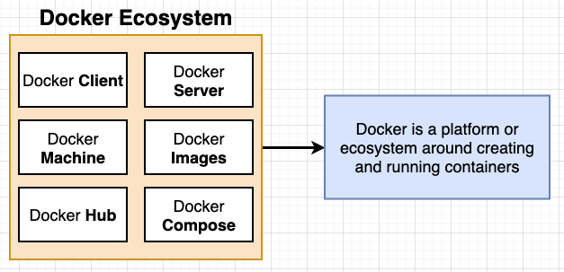

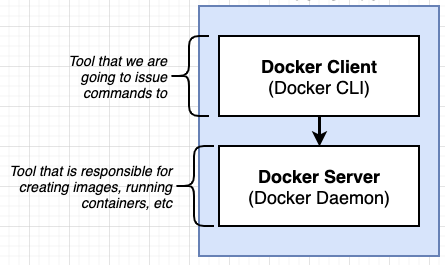

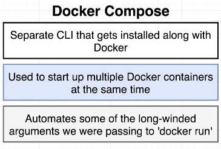

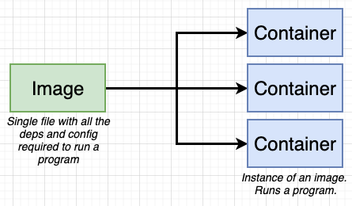

When we install Docker, Docker creates a Linux virtual machine. Everything related to Docker is run within this machine.

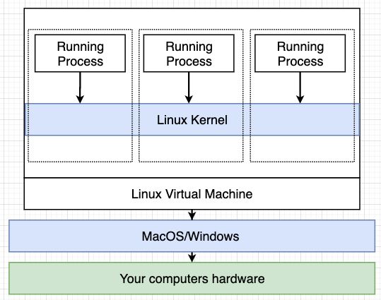

# Why use Docker?


# What happens when you run `docker run hello-world`?

When we run command `docker run hello-world` in terminal, we interact with `Docker Client`. We tell Docker Cli what we want to do, Docker Cli forward it to `Docker Server` to process.

`hello-world` is the name of the image. The Docker Server first check in the image cache to see if the image already exists, if not, it reaches out to a free library called `Docker Hub` to download the image and save it in the cache.

Docker Server uses the image to create a container, and start the container with the default command.

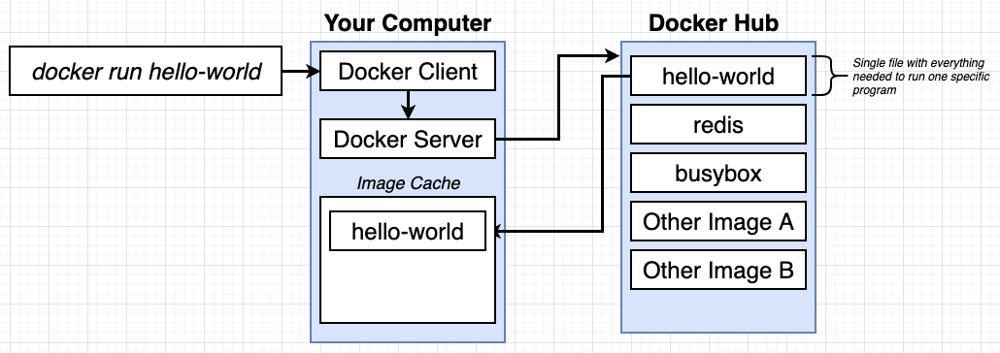

# What is a container?

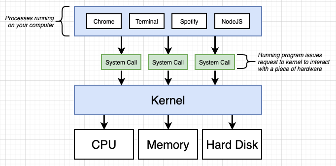

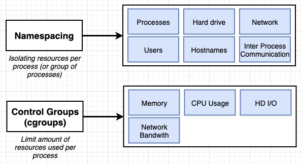

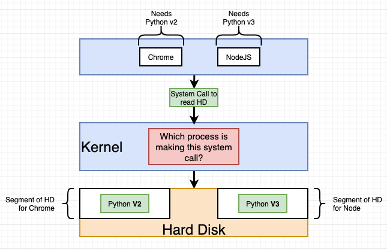

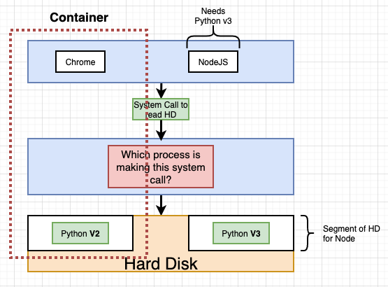

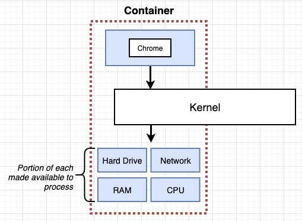

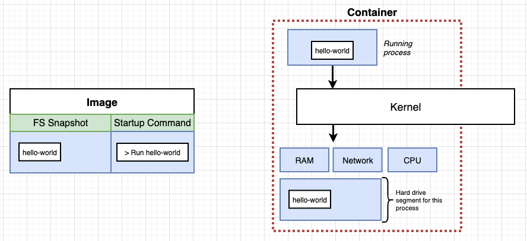

# Commands in Docker Client

Command `run` is a combination of two commands `create` and `start`. It creates a container based on the image, and runs the container with the default command or the override command (if provided). Whatever command we enter, the image has to support it (has code to run it)

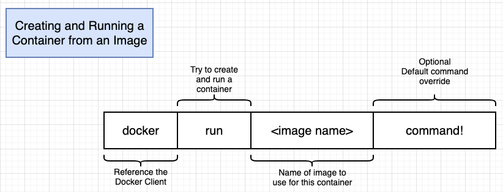

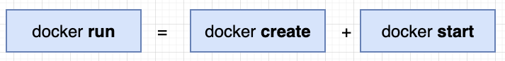

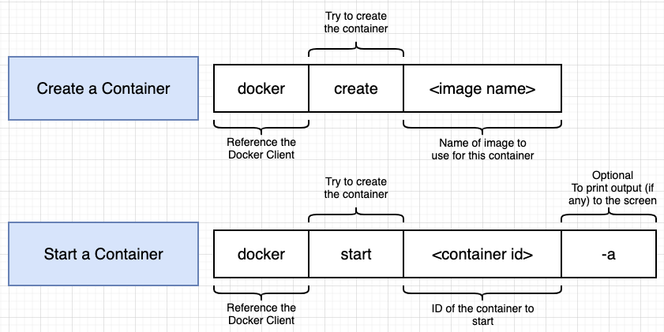

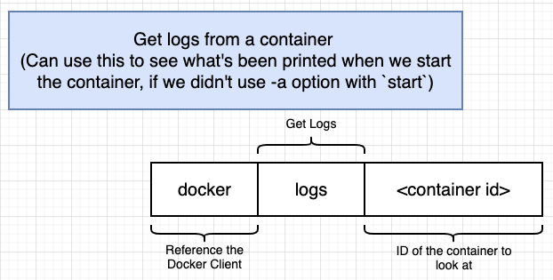


We can use `docker exec` to execute a container that's been created and run before. We cannot override starting command because we are not creating a new container, we're only execute an existing container

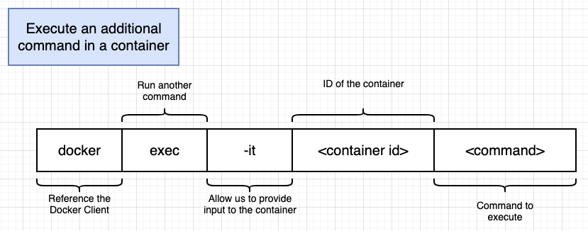

We can use `docker stop` or `docker kill` to end a running container (in case we don't have the current running container in a terminal window to `cmd C` to exit)

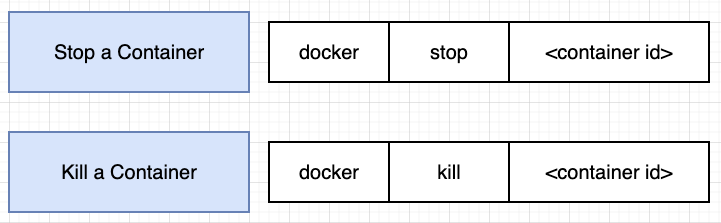

`docker stop` issues a `SIGTERM` to the container and gives it 10 seconds to gracefully shut down its processes. As a fallback, if after 10s, the container is still running, `docker kill` will be called to shut the container down immediately

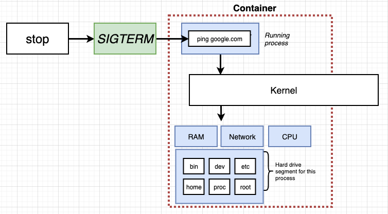

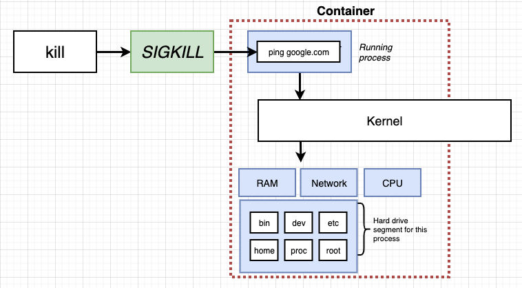

Example of running a redis container

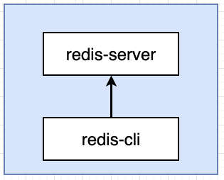

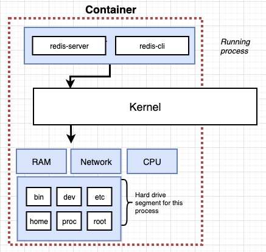

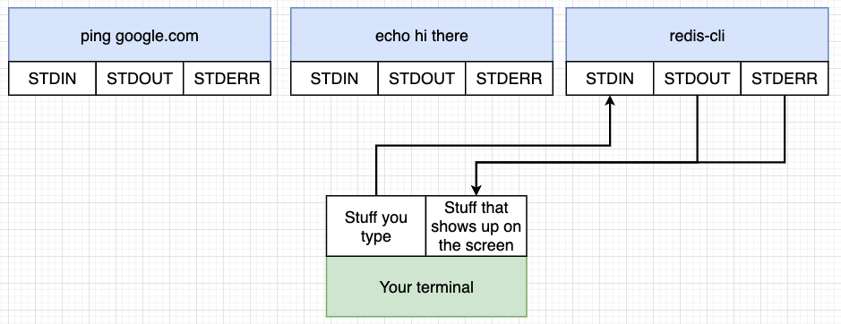

## New way Docker CLI commands

- `docker container --help`: get the list of subcommands that works with command `container`
- `docker container ls`: list out running docker containers (~ `docker ps`)
- `docker container ls -a`: list out running docker containers (~ `docker ps --all`)
- `docker container run --publish 80:80 --detach --name webhost nginx`: (~ `docker run -p 80:80 -d --name webhost nginx`) run nginx container downloaded from Docker Hub. `--name webhost` is to set the name of this container to webhost instead of using the randomly generated name by docker
- `docker container logs webhost`: (~ `docker logs webhost`)
- `docker container top webhost`: display running processes of a container
- `docker container rm CONTAINER_ID CONTAINER_ID CONTAINER_ID`: (~ `docker system prune`) to remove containers
- `docker container rm -f CONTAINER_ID`: to force remove a running container

# Create Custom Image

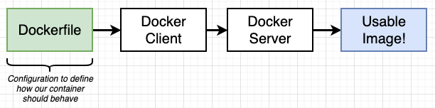

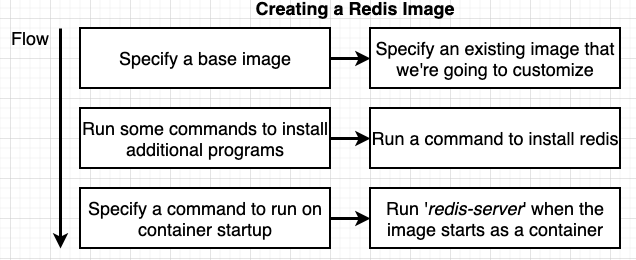

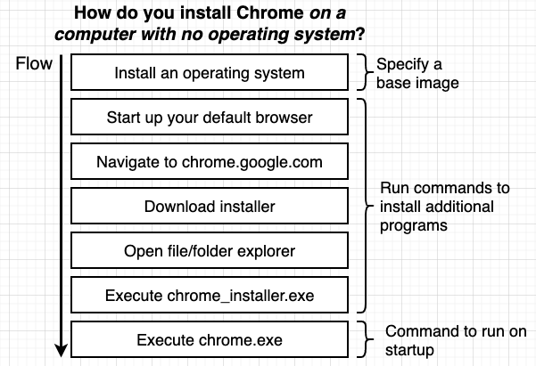

```Dockerfile
// in Dockerfile (no extension)
# Use an existing docker image as a base
FROM alpine

# Download and install a dependency
RUN apk add --update redis

# Tell the image what to do when it starts as a container
CMD ["redis-server"]
```

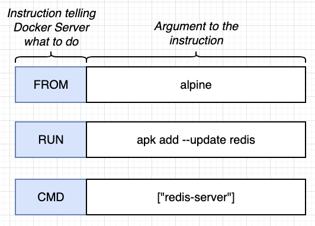

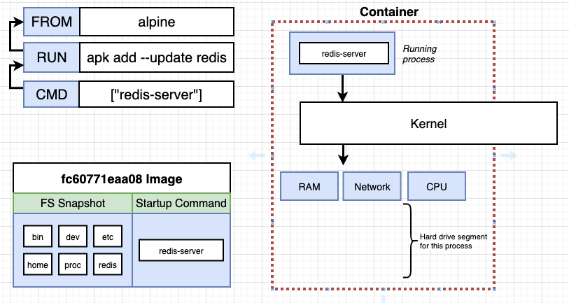

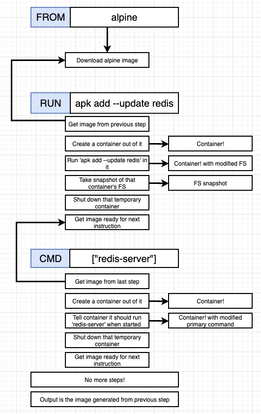

After we run `docker build .` at the current directory (where's all the files, and code needs to be included in the image), docker creates the image and saves cache of each step container (`FROM`, `RUN`, `CMD`), so that if it sees the instruction is the same, it'll use cache. This makes building docker image more efficient. So if we add `RUN apk add --update gcc` after update redis, and run `docker build .`, docker uses cache it had for alpine, for running redis, it only needs to run the added step and whatever's after it. So it's best to try to add additional steps as far down as possible.

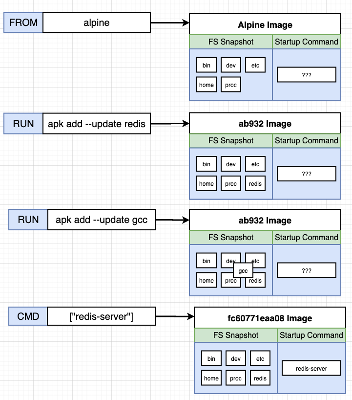


How to add a name to the image

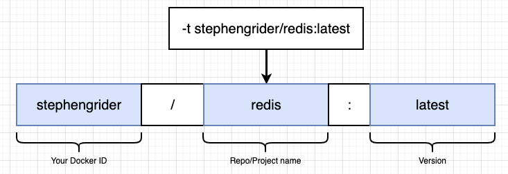

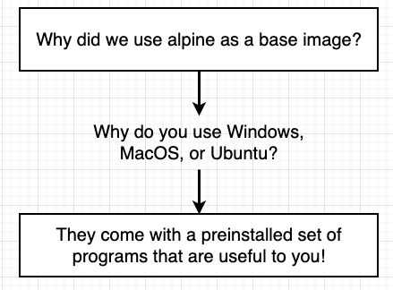

# Create A Docker Image for a Simple Node App

```Dockerfile
# Specify a base image
FROM node:alpine

# Define which folder in the base image that we will install dependencies
WORKDIR /usr/app

# install some dependencies
COPY ./package.json ./
RUN npm install

# Copy the rest of the code to the current working directory
COPY ./ ./

# defaul command
CMD ["npm", "start"]
```

- We have to use `node:alpine` as the base image because the `alpine` base image we use before doesn't include `npm`, so we have to get an image with node preinstalled (we could also add more code to install node to the base alpine). `:alpine` simply means we only get the bare minium file needed for this node image, not the full node image

- `WORKDIR /usr/app`: We want to have a working directory as a sub-directory of the base image, in case our files have the same name with what the base image file system already has

- `COPY ./package.json ./`: copy the file package.json from the current `build .` folder, to the working directory of the docker image, in this case it is what we define in `WORKDIR /usr/app`

- `RUN npm install`: install all dependencies in the file package.json

- We split into 2 copy commands so that when there's no changes to the package.json file, there's no need to run `npm install` again. For a big project, that would take too long

- `docker build -t ngantxnguyen/simpleweb .`: in terminal of the build directory (it'd be `2-simple-web` in this case)

- `docker run -p 5000:8080 ngantxnguyen/simpleweb`: to map requests from localhost port 5000 to this container on port 8080 (without mapping, we won't be able to access the node app within the container)

- `docker run -it ngantxnguyen/simpleweb sh`: to access the container file system in terminal

# Use Docker Compose to automatically do networking between multiple containers

**Project: 3-visits**

In the root directory (3-visits), create a `docker-compose.yml` file. To use `docker-compose` command in terminal, we need to make sure we in the same directory as the `docker-compose.yml` file because `docker-compose` cmd always refers to that file to run its sub-commands.

`docker-compose.yml` is where we set up to build/run and connect different containers together. When we declare those containers in this `.yml` file, docker-compose automatically do the networking part to for these containers to communicate with each other.

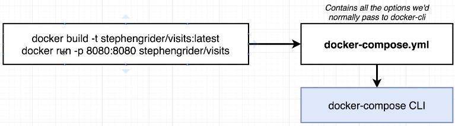

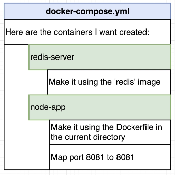

```yml
version: '3'
services:
  redis-server:
    image: 'redis'
  node-app:
    restart: on-failure
    build: .
    ports:
      - '4001:8081'
```

```js
// in NodeJS app index.js
const client = redis.createClient({
  host: 'redis-server',
  port: 6379,
});
```

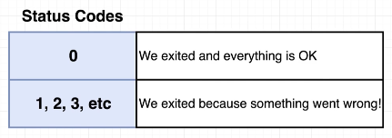

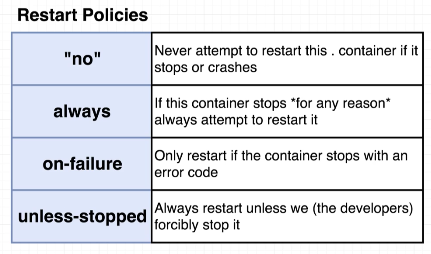

- For the NodeJS app to connect to redis db server, we use the name we declare in the `services` of the yml file as the host of this redis server. When docker sees that, it knows we want to connect to the container called `redis-server`
- `restart: on-failure`: restart policy for each container based on the process.exit status code
- `build: .`: look into the current directory, find the Dockerfile and build this container based on that
- `image: 'redis'`: Build this redis-server container based on an image on Docker Hub
- `ports: - '4001:8081'`: Mapping port on localhost to port 8081 of this node-app container

To run/build all of those containers using `docker-compose`

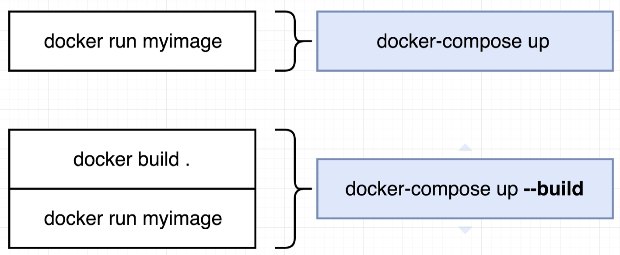

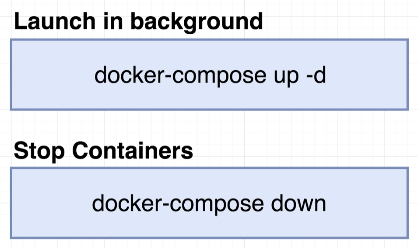
