# What is Docker?


When we install Docker, Docker creates a Linux virtual machine. Everything related to Docker is run within this machine.


# Why use Docker?


# What happens when you run `docker run hello-world`?

When we run command `docker run hello-world` in terminal, we interact with `Docker Client`. We tell Docker Cli what we want to do, Docker Cli forward it to `Docker Server` to process.

`hello-world` is the name of the image. The Docker Server first check in the image cache to see if the image already exists, if not, it reaches out to a free library called `Docker Hub` to download the image and save it in the cache.

Docker Server uses the image to create a container, and start the container with the default command.


# What is a container?


# Commands in Docker Client

Command `run` is a combination of two commands `create` and `start`. It creates a container based on the image, and runs the container with the default command or the override command (if provided). Whatever command we enter, the image has to support it (has code to run it)


We can use `docker exec` to execute a container that's been created and run before. We cannot override starting command because we are not creating a new container, we're only execute an existing container


We can use `docker stop` or `docker kill` to end a running container (in case we don't have the current running container in a terminal window to `cmd C` to exit)


`docker stop` issues a `SIGTERM` to the container and gives it 10 seconds to gracefully shut down its processes. As a fallback, if after 10s, the container is still running, `docker kill` will be called to shut the container down immediately


Example of running a redis container


## New way Docker CLI commands

- `docker container --help`: get the list of subcommands that works with command `container`
- `docker container ls`: list out running docker containers (~ `docker ps`)
- `docker container ls -a`: list out running docker containers (~ `docker ps --all`)
- `docker container run --publish 80:80 --detach --name webhost nginx`: (~ `docker run -p 80:80 -d --name webhost nginx`) run nginx container downloaded from Docker Hub. `--name webhost` is to set the name of this container to webhost instead of using the randomly generated name by docker
- `docker container logs webhost`: (~ `docker logs webhost`)
- `docker container top webhost`: display running processes of a container
- `docker container rm CONTAINER_ID CONTAINER_ID CONTAINER_ID`: (~ `docker system prune`) to remove containers
- `docker container rm -f CONTAINER_ID`: to force remove a running container

# Create Custom Image


```Dockerfile
// in Dockerfile (no extension)
# Use an existing docker image as a base
FROM alpine

# Download and install a dependency
RUN apk add --update redis

# Tell the image what to do when it starts as a container
CMD ["redis-server"]
```


After we run `docker build .` at the current directory (where's all the files, and code needs to be included in the image), docker creates the image and saves cache of each step container (`FROM`, `RUN`, `CMD`), so that if it sees the instruction is the same, it'll use cache. This makes building docker image more efficient. So if we add `RUN apk add --update gcc` after update redis, and run `docker build .`, docker uses cache it had for alpine, for running redis, it only needs to run the added step and whatever's after it. So it's best to try to add additional steps as far down as possible.


How to add a name to the image


# Create A Docker Image for a Simple Node App

```Dockerfile
# Specify a base image
FROM node:alpine

# Define which folder in the base image that we will install dependencies
WORKDIR /usr/app

# install some dependencies
COPY ./package.json ./
RUN npm install

# Copy the rest of the code to the current working directory
COPY ./ ./

# defaul command
CMD ["npm", "start"]
```

- We have to use `node:alpine` as the base image because the `alpine` base image we use before doesn't include `npm`, so we have to get an image with node preinstalled (we could also add more code to install node to the base alpine). `:alpine` simply means we only get the bare minium file needed for this node image, not the full node image

- `WORKDIR /usr/app`: We want to have a working directory as a sub-directory of the base image, in case our files have the same name with what the base image file system already has

- `COPY ./package.json ./`: copy the file package.json from the current `build .` folder, to the working directory of the docker image, in this case it is what we define in `WORKDIR /usr/app`

- `RUN npm install`: install all dependencies in the file package.json

- We split into 2 copy commands so that when there's no changes to the package.json file, there's no need to run `npm install` again. For a big project, that would take too long

- `docker build -t ngantxnguyen/simpleweb .`: in terminal of the build directory (it'd be `2-simple-web` in this case)

- `docker run -p 5000:8080 ngantxnguyen/simpleweb`: to map requests from localhost port 5000 to this container on port 8080 (without mapping, we won't be able to access the node app within the container)

- `docker run -it ngantxnguyen/simpleweb sh`: to access the container file system in terminal

# Use Docker Compose to automatically do networking between multiple containers

**Project: 3-visits**

In the root directory (3-visits), create a `docker-compose.yml` file. To use `docker-compose` command in terminal, we need to make sure we in the same directory as the `docker-compose.yml` file because `docker-compose` cmd always refers to that file to run its sub-commands.

`docker-compose.yml` is where we set up to build/run and connect different containers together. When we declare those containers in this `.yml` file, docker-compose automatically do the networking part to for these containers to communicate with each other.


```yml
version: '3'
services:
  redis-server:
    image: 'redis'
  node-app:
    restart: on-failure
    build: .
    ports:
      - '4001:8081'
```

```js
// in NodeJS app index.js
const client = redis.createClient({
  host: 'redis-server',
  port: 6379,
});
```


- For the NodeJS app to connect to redis db server, we use the name we declare in the `services` of the yml file as the host of this redis server. When docker sees that, it knows we want to connect to the container called `redis-server`
- `restart: on-failure`: restart policy for each container based on the process.exit status code
- `build: .`: look into the current directory, find the Dockerfile and build this container based on that
- `image: 'redis'`: Build this redis-server container based on an image on Docker Hub
- `ports: - '4001:8081'`: Mapping port on localhost to port 8081 of this node-app container

To run/build all of those containers using `docker-compose`


# Production-Grade Workflow

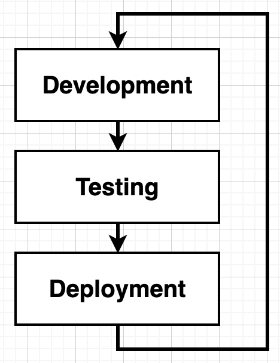
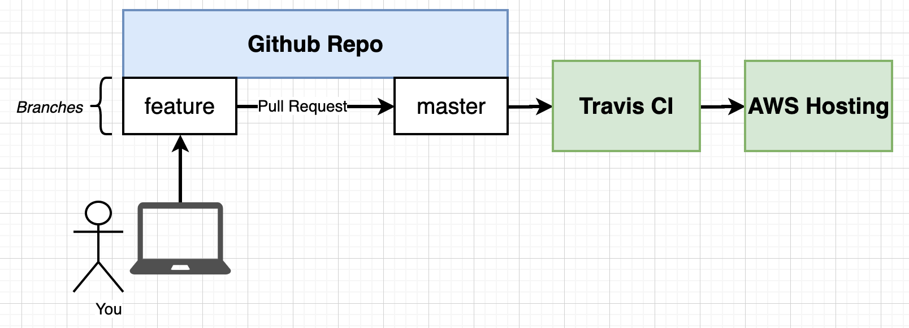
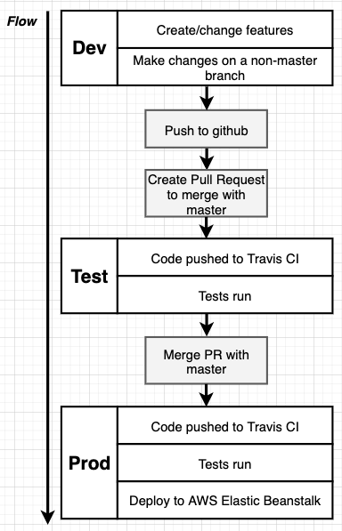

## Workflow example with a React App

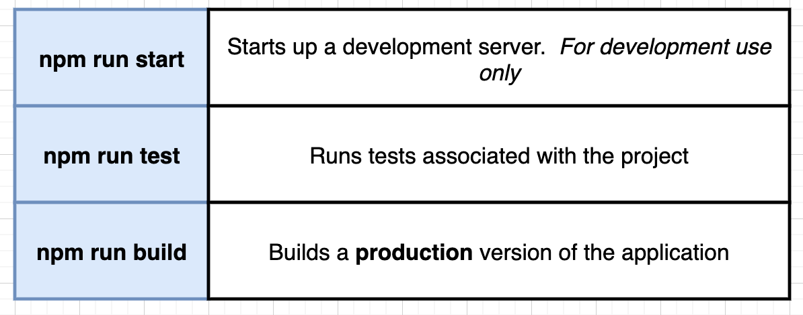
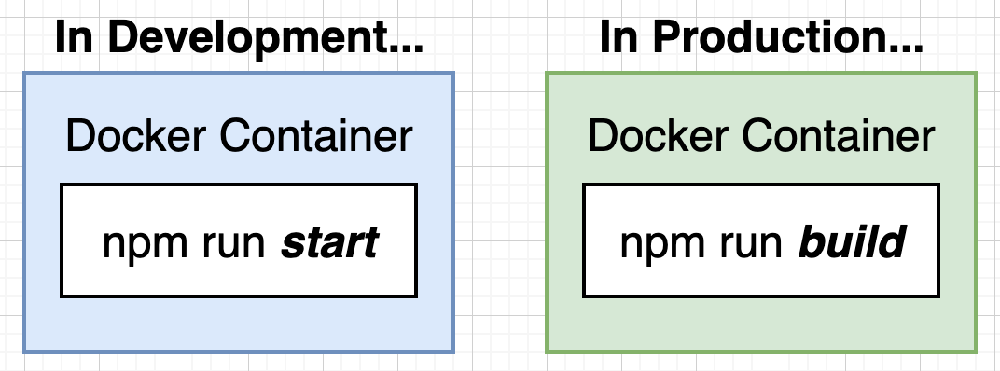

- ### Development

  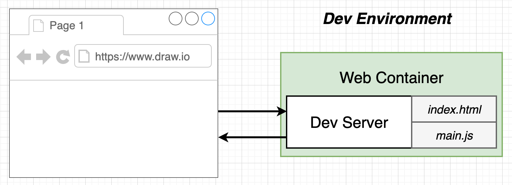

  - Have a docker file made specifically for development called `Dockerfile.dev`

    ```Dockerfile
    FROM node:alpine

    WORKDIR '/app'

    COPY package.json .
    RUN npm install

    COPY . .

    CMD [ "npm", "run", "start" ]
    ```

  - To build and run this dev container in terminal (root directory 4-frontend)

    ```
    docker build -f Dockerfile.dev .

    docker run -it -p 3000:3000 -v /app/node_modules -v $(pwd):/app CONTAINER_ID
    ```

  - For the docker container to reflect the updates when we make changes to the main content of the react app (`App.js`) without us manually rebuild the container, we use `Docker Volume`.

    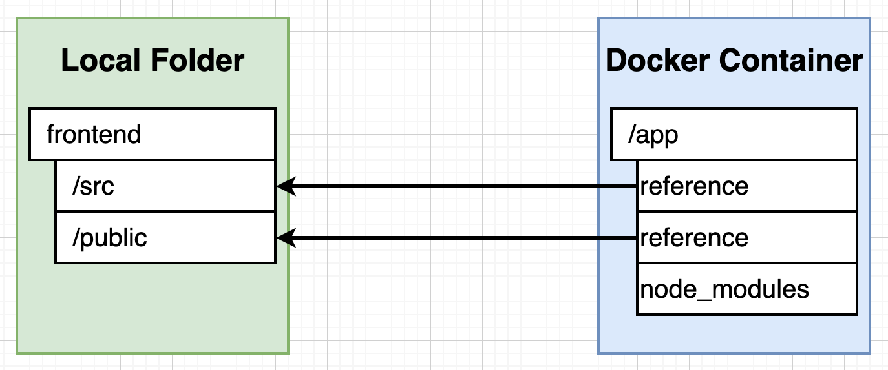
    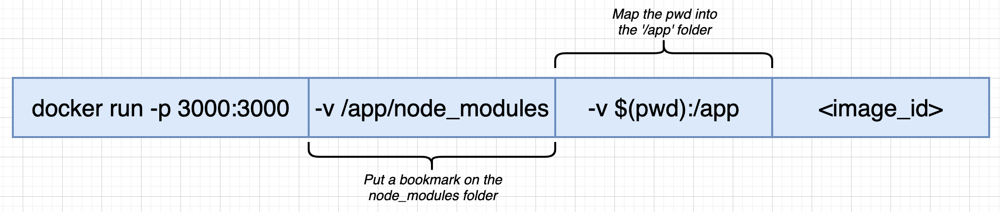

  - In order not having to type the 2 above command everytime we want to start up this dev container, we create a docker-compose.yml to combine the 2 steps and run `docker-compose up` command instead

    ```yml
    version: '3'
    services:
      web:
        stdin_open: true
        build:
          context: .
          dockerfile: Dockerfile.dev
        ports:
          - '3000:3000'
        volumes:
          - /app/node_modules
          - .:/app
    ```

- ### Testing

  There are 2 possible ways to do testing container with docker. In both methods, we want to make sure the test container will rerun when we make changes to any tests

  - **Method 1**

    Step 1: Start up the dev server `docker-compose up`

    Step 2: Open another terminal tab, in the same directory, get the above running container ID by `docker ps`. Then run this command with that ID `docker run CONTAINER_ID npm run test`. By overriding the container, we get access to the same setting that updates the output if there're changes in the source code. So when we make changes to the file `App.test.js`, the test container will rerun the test.

    This method allows us to use the stdin to interact with the test suite if it provides any sub-commands.

  - **Method 2**

    Add a test service to the docker-compose.yml, in addition to the web service

    ```yml
    tests:
      build:
        context: .
        dockerfile: Dockerfile.dev
      volumes:
        - /app/node_modules
        - .:/app
      command: ['npm', 'run', 'test']
    ```

    In terminal, `docker-compose up` will run both containers. However, we will not be able to send any input/command to the test suite in terminal

    Reason: Run `docker exec -it CONTAINER_ID npm run test` => `ps` to show the processes of this container. We'll see that there are multiple processes that's running this container. It starts with the main `npm` process, which the stdin is attached to the terminal. The actual test is running in another process executing file start.js. This is the process that we need to attach the stdin from the terminal for it to receive sub-command of the tests. However, there's no way we can switch the stdin to the sub-process.

    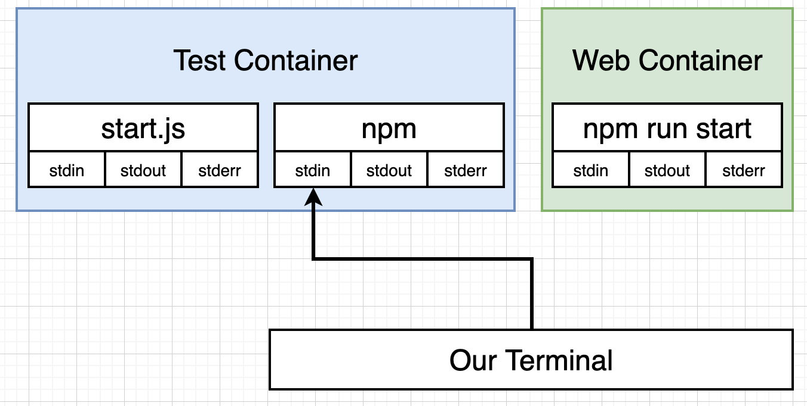

- ### Production

  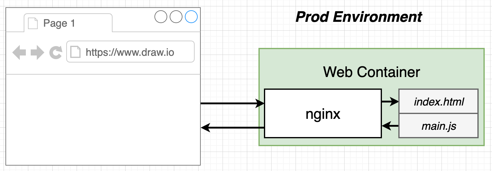
  
  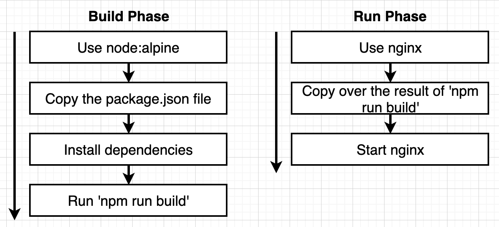

  We create another `Dockerfile` for a production container

  ```Dockerfile
  FROM node:alpine as builder
  WORKDIR '/app'
  COPY package.json .
  RUN npm install
  COPY . .
  RUN npm run build

  FROM nginx
  COPY --from=builder /app/build usr/share/nginx/html
  ```

  Each `FROM` is a phase. `FROM node:alpine as builder`: we name this phase `builder` so we can refer to it at a later phase

  For the nginx server to work, we only need the build folder from the previous phase. When we don't specify a `CMD` for the image, it'll use the default CMD that nginx image has

  In terminal, run `docker build .`, copy the container ID. To start the prod server, run `docker run -p 8080:80 CONTAINER_ID`. Port `80` is default for `nginx`

# Single Container Deployment: Continuous Integration and Deployment with Travis CI and AWS Elastic Beanstalk

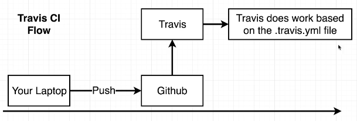
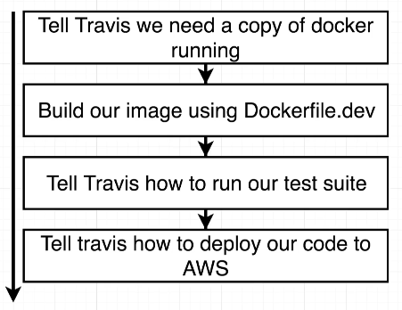
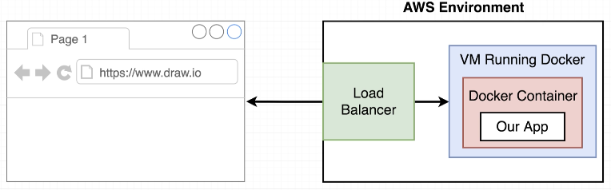
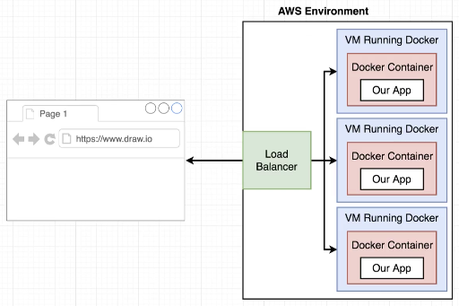

- Create an account with `travis-ci.org` by signing in with Github. It'll link all github repo to Travis.
- Travis => setting (under Account) => search for the docker-react github project => Turn on the switch for Travis to watch for changes in that repo
- In our local repository docker-react (4-frontend), create a `.travis.yml` config file for Travis that follows the above flow

  ```yml
  sudo: required
  language: generic
  services:
    - docker

  before_install:
    - docker build -t ngantxnguyen/docker-react -f Dockerfile.dev .

  script:
    - docker run -e CI=true ngantxnguyen/docker-react npm run test

  deploy:
    provider: elasticbeanstalk
    region: 'us-east-2'
    app: 'docker-react'
    env: 'DockerReact-env'
    bucket_name: 'elasticbeanstalk-us-east-2-581442385236'
    bucket_path: 'docker-react'
    on:
      branch: master
    access_key_id: $AWS_ACCESS_KEY
    secret_access_key: $AWS_SECRET_KEY
  ```

- We get the AWS access key and secret key by create a new IAM user (with full access to Elastic Beanstalk policy). After the user creation, AWS will display these 2 keys

- We have to create a new Application in AWS Elastic Beanstalk, give it a name (that'll be the app name), choose docker. This process will automatically create a S3 bucket (where it'll store all the built version of the github repo).

- In prod `Dockerfile`, we need to add `EXPOSE 80` so that once it is deployed to Elastic Beanstalk, we can access port 80 of the container. Make changes to the `.` as in `COPY package*.json ./` because AWS has problem processing the dot. Lastly, we need to remove named stages, refer to the stages/phases as number `COPY --from=0`.

- Issues with Single Container Deployment

  The image was deployed twice, once on travis when we build our test, and a second time when we push our code from travis to Amazon Elastic Beanstalk. Not the best approach because we take our web server to build Docker image when the server should only concern about building the server.

  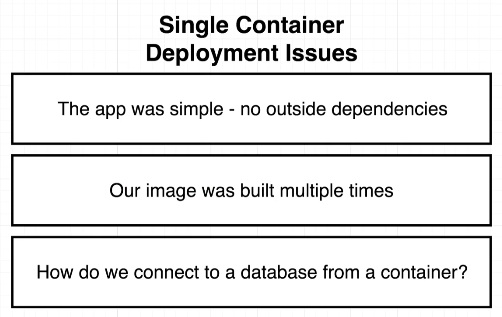

# Multi-Containers Deployment to AWS EB with additional AWS DB Services

**Project: 5-complex**

To solve some issues mentioned in the single container deployment, we now let Travis upload all container images to Docker Hub. AWS EB will only pull these images from Docker Hub and deploy, it will not build these images.

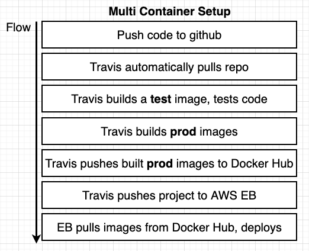

Similar to the single container deployment, we still use a `nginx` server with React app

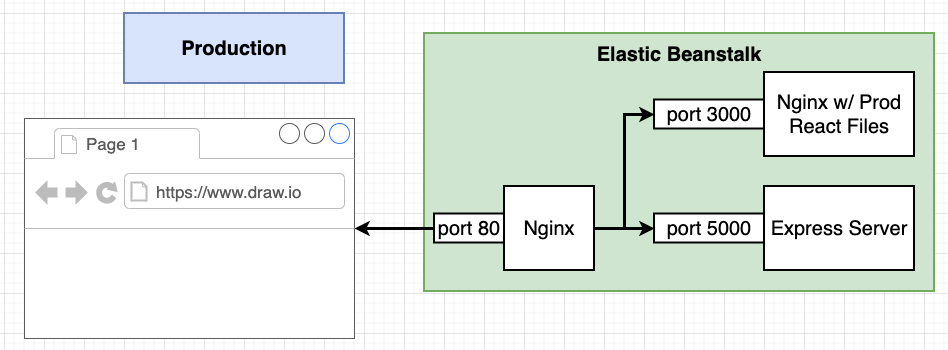

EB doesn't know how to work with Containers. Eternally, when we use containers with EB, AWS uses ECS to run containers based on the task definition files. That's why we need to provide task definition in `Dockerrun.aws.json` file. When Travis deploy to AWS EB, ECS will look at this file and run accordingly

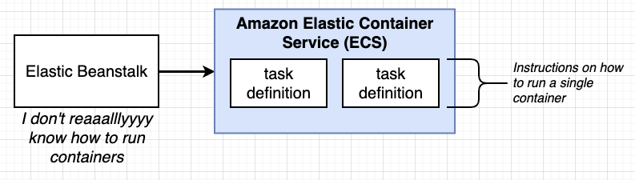

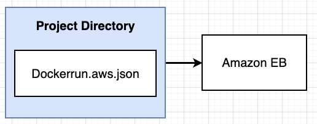

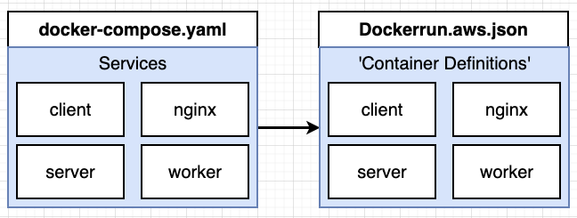

During Development, we created 2 containers to run redis and postgres. However, in development, it is recommended to use services like AWS Elastic Cache and AWS RDS

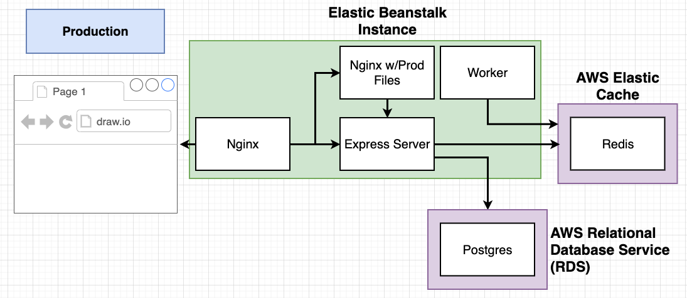

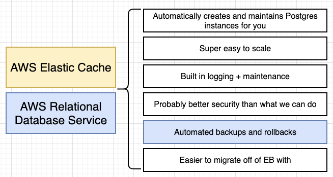

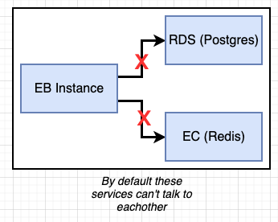

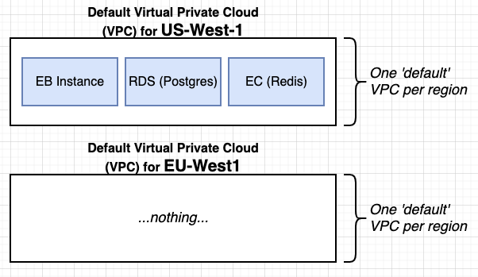

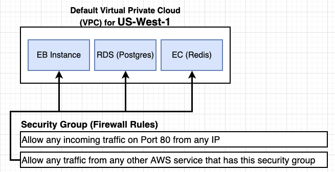

## AWS Configuration Cheat Sheet for ES, EC, RDS

- ### RDS Database Creation

  - Go to AWS Management Console and use Find Services to search for RDS
  - Click Create database button
  - Select PostgreSQL
  - Check 'only enable options eligible for RDS Free Usage Tier' and click Next button
  - Scroll down to Settings Form
  - Set DB Instance identifier to multi-docker-postgres
  - Set Master Username to postgres
  - Set Master Password to postgres and confirm
  - Click Next button
  - Make sure VPC is set to Default VPC
  - Scroll down to Database Options
  - Set Database Name to fibvalues
  - Scroll down and click Create Database button

- ### ElastiCache Redis Creation

  - Go to AWS Management Console and use Find Services to search for ElastiCache
  - Click Redis in sidebar
  - Click the Create button
  - Make sure Redis is set as Cluster Engine
  - In Redis Settings form, set Name to multi-docker-redis
  - Change Node type to 'cache.t2.micro'
  - Change Number of replicas to 0
  - Scroll down to Advanced Redis Settings
  - Subnet Group should say “Create New"
  - Set Name to redis-group
  - VPC should be set to default VPC
  - Tick all subnet’s boxes
  - Scroll down and click Create button

- ### Creating a Custom Security Group

  - Go to AWS Management Console and use Find Services to search for VPC
  - Click Security Groups in sidebar
  - Click Create Security Group button
  - Set Security group name to multi-docker
  - Set Description to multi-docker
  - Set VPC to default VPC
  - Click Create Button
  - Click Close
  - Manually tick the empty field in the Name column of the new security group and type multi-docker, then click the checkmark icon.
  - Scroll down and click Inbound Rules
  - Click Edit Rules button
  - Click Add Rule
  - Set Port Range to 5432-6379
  - Click in box next to Custom and start typing 'sg' into the box. Select the Security Group you just created, it should look similar to 'sg-…. | multi-docker’
  - Click Save Rules button
  - Click Close

- ### Applying Security Groups to ElastiCache

  - Go to AWS Management Console and use Find Services to search for ElastiCache
  - Click Redis in Sidebar
  - Check box next to Redis cluster and click Modify
  - Change VPC Security group to the multi-docker group and click Save
  - Click Modify

- ### Applying Security Groups to RDS

  - Go to AWS Management Console and use Find Services to search for RDS
  - Click Databases in Sidebar and check box next to your instance
  - Click Modify button
  - Scroll down to Network and Security change Security group to multi-docker
  - Scroll down and click Continue button
  - Click Modify DB instance button

- ### Applying Security Groups to Elastic Beanstalk

  - Go to AWS Management Console and use Find Services to search for Elastic Beanstalk
  - Click the multi-docker application tile
  - Click Configuration link in Sidebar
  - Click Modify in Instances card
  - Scroll down to EC2 Security Groups and tick box next to multi-docker
  - Click Apply and Click Confirm

- ### Setting Environment Variables

  - Go to AWS Management Console and use Find Services to search for Elastic Beanstalk
  - Click the multi-docker application tile
  - Click Configuration link in Sidebar
  - Select Modify in the Software tile
  - Scroll down to Environment properties
  - In another tab Open up ElastiCache, click Redis and check the box next to your cluster. Find the Primary Endpoint and copy that value but omit the :6379
  - Set REDIS_HOST key to the primary endpoint listed above, remember to omit :6379
  - Set REDIS_PORT to 6379
  - Set PGUSER to postgres
  - Set PGPASSWORD to postgrespassword
  - In another tab, open up RDS dashboard, click databases in sidebar, click your instance and scroll to Connectivity and Security. Copy the endpoint.
  - Set the PGHOST key to the endpoint value listed above.
  - Set PGDATABASE to fibvalues
  - Set PGPORT to 5432
  - Click Apply button

- ### IAM Keys for Deployment

  - Go to AWS Management Console and use Find Services to search for IAM
  - Click Users link in the Sidebar
  - Click Add User button
  - Set User name to multi-docker-deployer
  - Set Access-type to Programmatic Access
  - Click Next:Permissions button
  - Select Attach existing polices directly button
  - Search for 'beanstalk' and check all boxes
  - Click Next:Review
  - Add tag if you want and Click Next:Review
  - Click Create User
  - Copy Access key ID and secret access key for use later

- ### AWS Keys in Travis

  - Open up Travis dashboard and find your multi-docker app
  - Click More Options, and select Settings
  - Scroll to Environment Variables
  - Add AWS_ACCESS_KEY and set to your AWS access key
  - Add AWS_SECRET_KEY and set to your AWS secret key

# KUBERNETES

## Just docker containers and AWS Elastic Beanstalk

When traffic goes to the website increases, EB (Load balancer) will duplicate the whole system instead of just the part that really needs to be scale

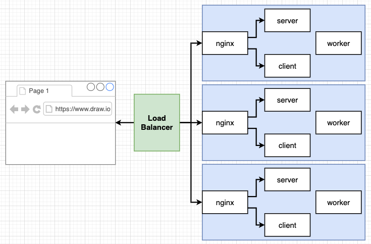

## Ideal Scaling with load balancer

Since the part that does the heavy work is the worker container, we only want to increases the number of workers

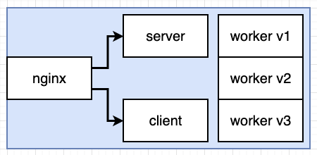

## Kubernetes Cluster

This is a Kubernetes Cluster, which will scale the needed part of the system

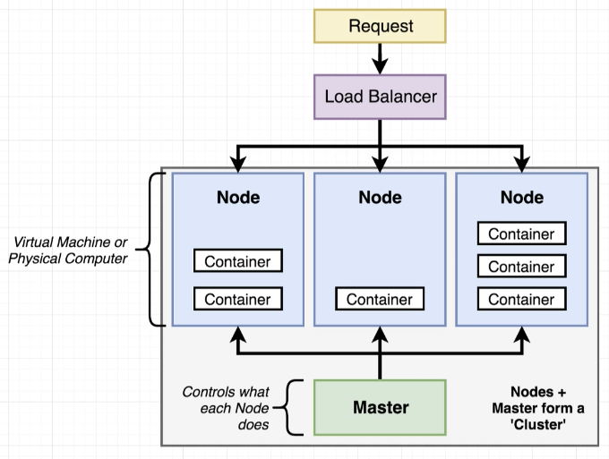

A cluster in kubernetes is a master of one or more nodes. A node is a Virtual Machine that runs some number of containers, these containers can be instantiated from different images. Those nodes are controled by a master, which has a set of different programs run on it to control which of the nodes running at a given time.

Outside of the cluster, the load balancer will relay requests to different nodes

## Kubernetes What & Why

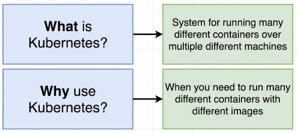

## Getting started to work with Kubernetes during development

Either in development or production, we always use `kubectl` to manage containers within a node

- ### Method 1: Docker Desktop's Kubernetes

  - 1. Click the Docker icon in the top macOS toolbar
  - 2. Click Preferences
  - 3. Click "Kubernetes" in the dialog box menu
  - 4. Check the “Enable Kubernetes” box
  - 5. Click "Apply"
  - 6. Click Install to allow the cluster installation (This may take a while).

  When we deploy the app, we can access by `localhost:nodePort`

- ### Method 2: minikube

  `minikube` is used during development to create small Kubernetes cluster like the diagram we saw above

  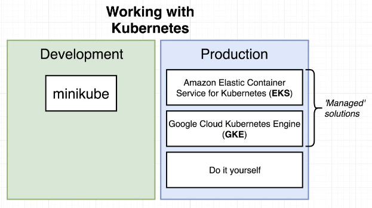

  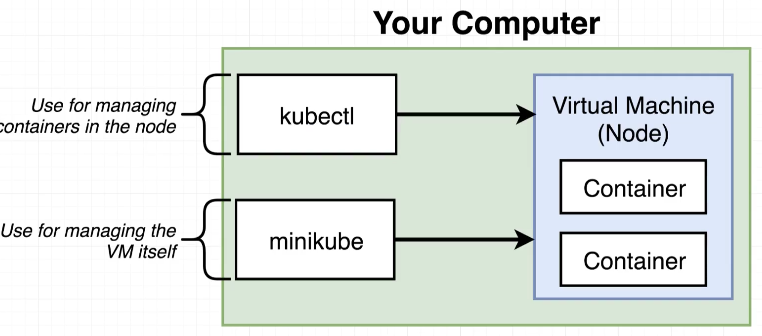

  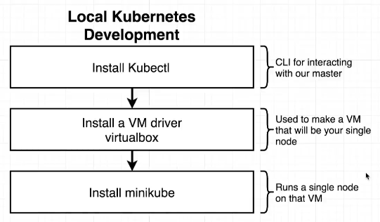

  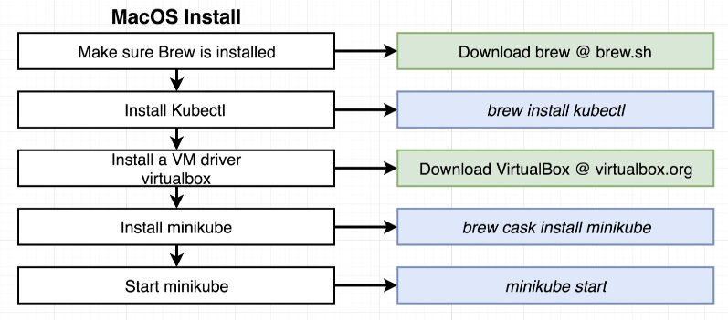

  We need to run `minikube ip` to know the IP address of the virtual machine where minikube created. It won't be at localhost like Docker Desktop's Kubernetes

## Docker Compose vs Kubernetes

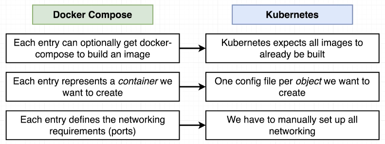

## Kubernetes Config files

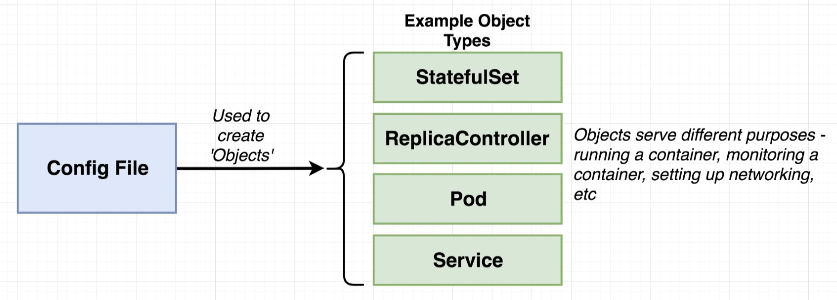

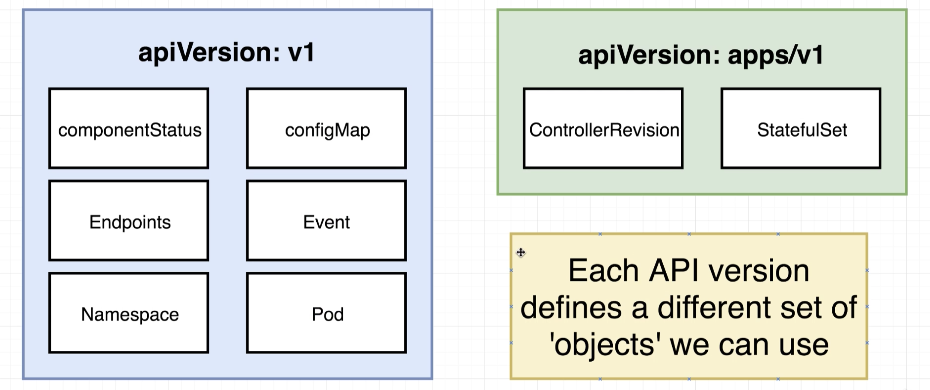

The programs in `Master` looks at Config files for each object to fullfil its responsibilities

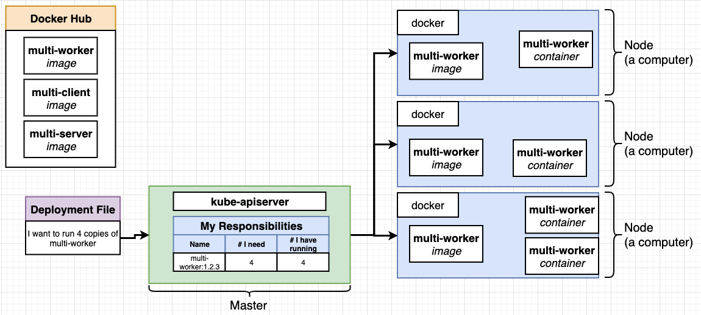

## Object Types

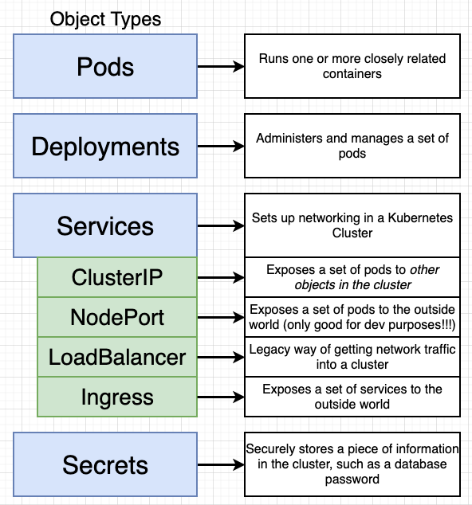

**A node runs some number of Objects**

- ### Pods

  In Kubernetes world, we cannot put containers directly in a node by itself. We have to put a container inside a Pod. A pod, a Kubernetes object, is a grouping of containers with a common purpose. The containers in a Pod has a close coupled relationship

  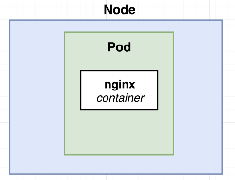

  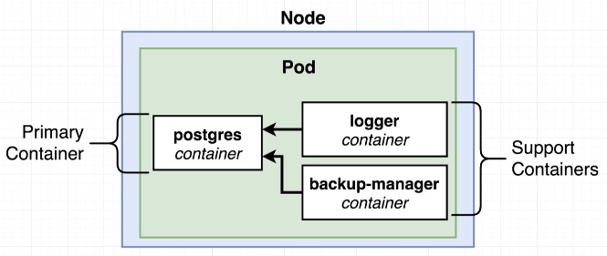

  `client-pod.yaml` - A pod configuration file

  ```yaml
  apiVersion: v1
  kind: Pod
  metadata:
    name: client-pod
    labels:
      component: web
  spec:
    containers:
      - name: client
        image: stephengrider/multi-client
        ports:
          - containerPort: 3000
  ```

- ### Services

  - #### NodePort

    `client-node-port.yaml` - Config file for NodePort

    ```yaml
    apiVersion: v1
    kind: Service
    metadata:
      name: client-node-port
    spec:
      type: NodePort
      ports:
        - port: 3050
          targetPort: 3000
          nodePort: 31515
      selector:
        component: web
    ```

    How Nodeport connect to a Pod

    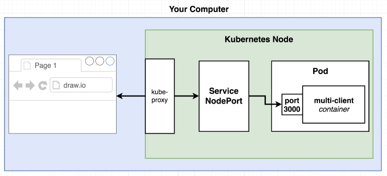

    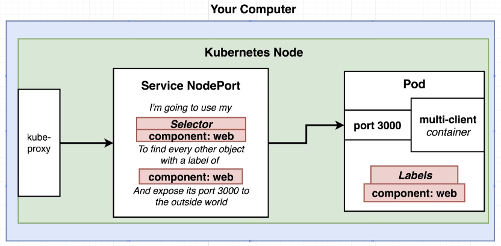

    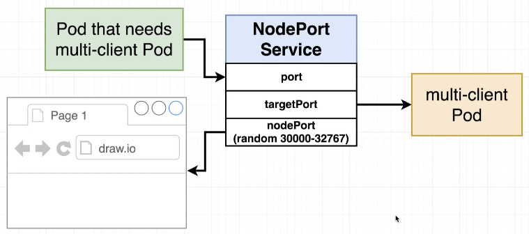

- ### Deployement

  

  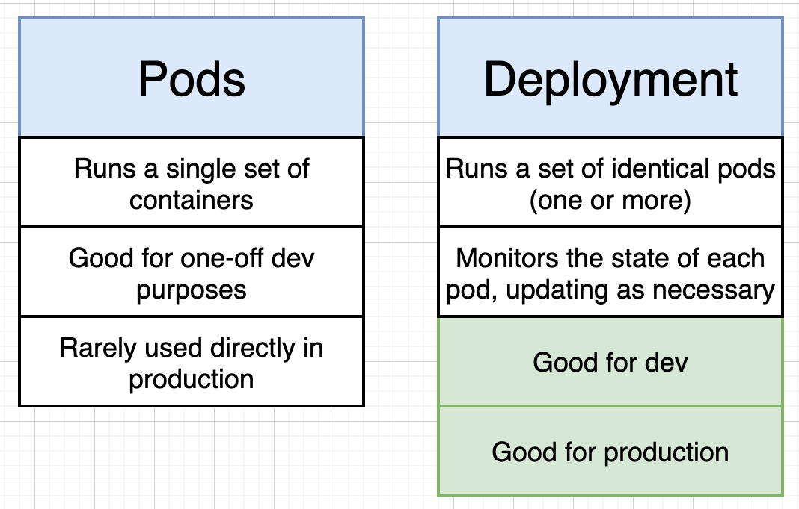

  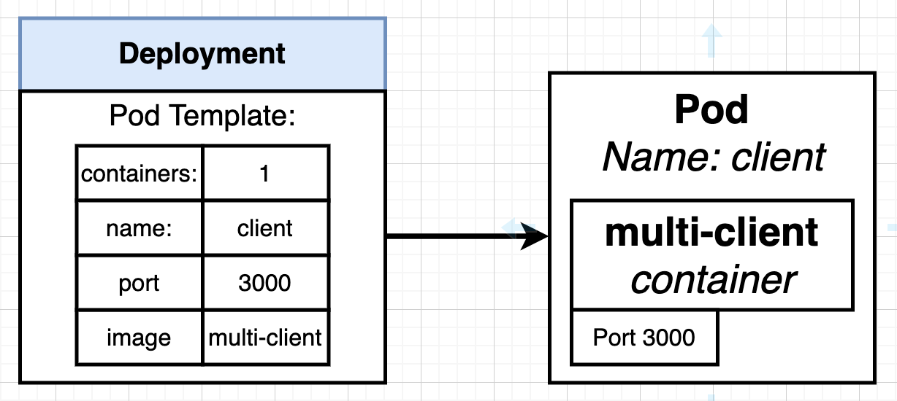

  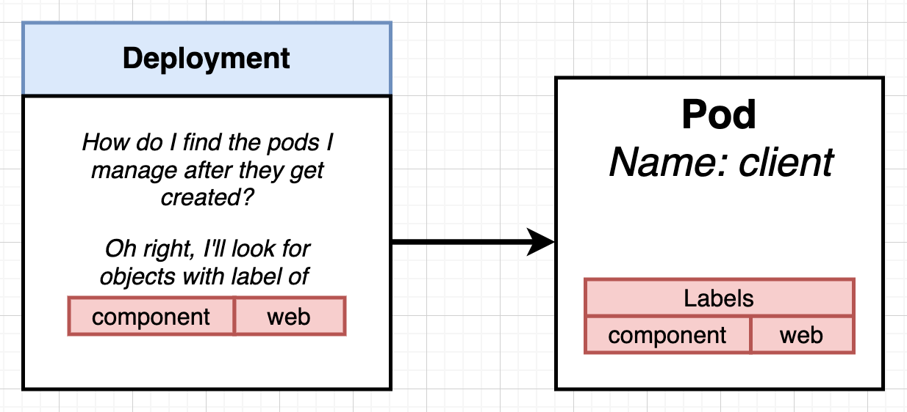

  A deployment config file with template is a pod similar to what we define above

  ```yaml
  apiVersion: apps/v1
  kind: Deployment
  metadata:
    name: client-deployment
  spec:
    replicas: 1
    selector:
      matchLabels:
        component: web
    template:
      metadata:
        labels:
          component: web
      spec:
        containers:
          - name: client
            image: stephengrider/multi-client
            ports:
              - containerPort: 3000
  ```

- ### Kubernetes Volume

  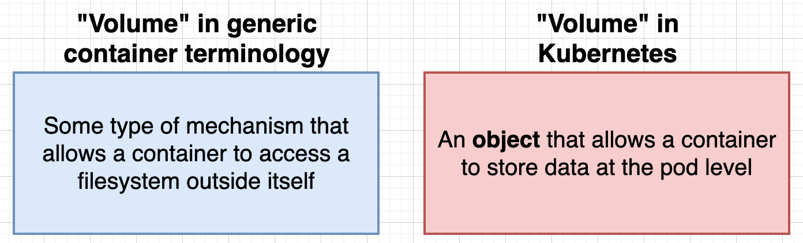
  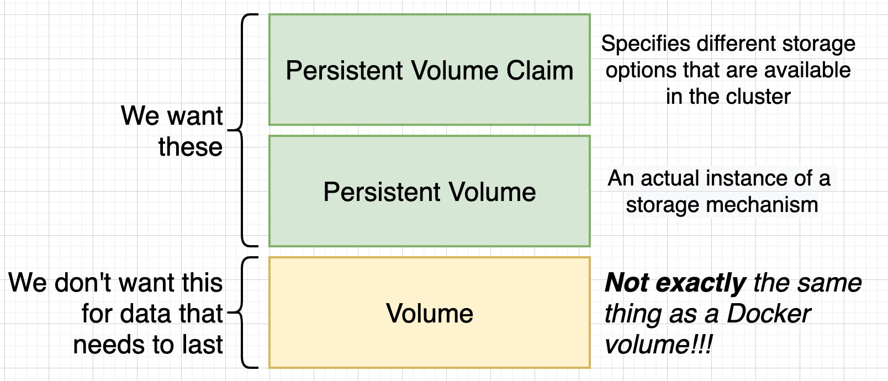
  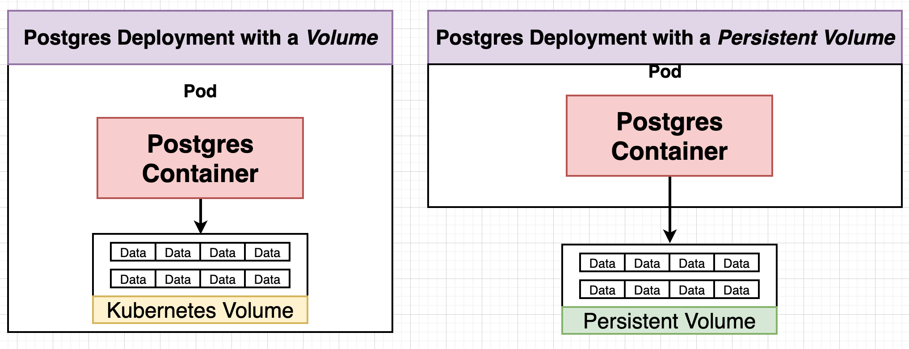
  

  We have to declare a config for a persistent volume claim to make/use a persistent volume

  This is `database-persistent-volume-claim.yaml`

  ```yaml
  apiVersion: v1
  kind: PersistentVolumeClaim
  metadata:
    name: database-persistent-volume-claim
  spec:
    accessModes:
      - ReadWriteOnce
    resources:
      requests:
        storage: 2Gi
  ```

  

  To use the persistent volume: (part of `postgres-deployment.yaml` under pod `template`)

  ```yaml
  spec:
    volumes:
      - name: postgres-storage
        persistentVolumeClaim:
          claimName: database-persistent-volume-claim
  ```

  
  

- ### ClusterIP

  

  ```yaml
  // server-cluster-ip-service.yaml, port is the port of this ClusterIP, targetPort is the port of each pod in the deployment
  apiVersion: v1
  kind: Service
  metadata:
    name: server-cluster-ip-service
  spec:
    type: ClusterIP
    selector:
      component: server
    ports:
      - port: 5000
        targetPort: 5000
  ```

  - This ClusterIP connects to all the pods inside a deployment (not the Deployment object itself). The ClusterIP object links to the pods by the key-value label `component: server` that declare in the Deployment template

    ```yaml
    // part of server-deployment
    template:
      metadata:
        labels:
          component: server
    ```

  - The metadata name in the Config file of a ClusterIP object is like a internal URL that allows other object to connect to it

    

    ```yaml
    // Template of worker-deployment.yaml
    spec:
      containers:
        - name: worker
          image: ngantxnguyen/multi-worker
          env:
            - name: REDIS_HOST
              value: redis-cluster-ip-service
            - name: REDIS_PORT
              value: '6379'
    ```

- ### Ingress

  

  

  Example of an Ingress Config file `ingress-service.yaml`

  ```yaml
  apiVersion: extensions/v1beta1
  kind: Ingress
  metadata:
    name: ingress-service
    annotations:
      kubernetes.io/ingress.class: nginx
      nginx.ingress.kubernetes.io/rewrite-target: /$1
  spec:
    rules:
      - http:
          paths:
            - path: /?(.*)
              backend:
                serviceName: client-cluster-ip-service
                servicePort: 3000
            - path: /api/?(.*)
              backend:
                serviceName: server-cluster-ip-service
                servicePort: 5000
  ```

## `Kubectl` CLI


First, make sure kubernetes is running, otherwise we can't use kubectl commands.

We need to run this apply command for each `yaml` config file

**6-simplek8s** Project

```
kubectl apply -f client-node-port.yaml
kubectl apply -f client-pod.yaml
```

In the browser, visit `localhost:31515`, we'll see the React app renders. (If use minikube, replace localhost with the Virtual Machine IP address that minikube created)


```
kubectl get pods
kubectl get services
```


`kubectl set image deployment/client-deployment client=stephengrider/multi-client:v5`


## Important takeaways


## Imperative Deployment vs **Declarative Deployment**


## Update an Object Config


- Limitation in updating a Pod

  

- For Deployment, we can update anything we need

## Update the Node with a new version of the container's image

  

  

`kubectl set image deployment/client-deployment client=stephengrider/multi-client:v5`

## Accessing the Node's containers

By default, Docker CLI on Mac connects to the Docker Server on Mac. Docker CLI doesn't connect to any container inside a Kubernetes cluster (Containers inside a Node). To make Docker CLI on Mac connect to, we run `eval $(minikube docker-env)`. It will temporary connect in that terminal.

An alternative to access to containers in a Kubernetes cluster is to access to minikube shell `minikube ssh`. Then we can use Docker CLI as normal.

  
  

  

## Project `7-complex` (Use Ingress, ClusterIP, Persistent Volume, Deployment and Deploy to Google Cloud)

- ### Structure

  

  - Create Persistent Volume Claim Config to use with Postgres

    

  - We need to make sure to provide Environment variables to templates that use server and worker images.

    The database password has to be stored and retrieve differently because it contains sensitive information. Create a Secret Object to store Postgres Database password `kubectl create secret generic pgpassword --from-literal PGPASSWORD=pass1234`

    

  - Create Ingress config (to direct traffic to the right services inside the cluster. In this app, if the url start with `/api` then it'll go to `server`, otherwise it'll go to `client`)
    
    

- ### Local Development Setup

  - Build and upload Docker Images

    ```sh
    docker build -t ngantxnguyen/multi-client -f ./client/Dockerfile ./client
    docker build -t ngantxnguyen/multi-server -f ./server/Dockerfile ./server
    docker build -t ngantxnguyen/multi-worker -f ./worker/Dockerfile ./worker

    docker push ngantxnguyen/multi-client
    docker push ngantxnguyen/multi-server
    docker push ngantxnguyen/multi-worker
    ```

  - Start a Kubernetes engine `minikube start`

  - Setup and use Ingress-Nginx locally with Minikube

    ```sh
    kubectl apply -f https://raw.githubusercontent.com/kubernetes/ingress-nginx/controller-0.32.0/deploy/static/provider/cloud/deploy.yaml

    minikube addons enable ingress
    ```

  - Make sure to already set database password as a Secret Obj
  - Create Objects based on the config files in folder k8s `kubectl apply -f k8s`

* ### Travis Build and Google Cloud Deploy

  
  
  

  - Create a GitHub repo for the project
  - Link the GitHub repo to Travis
  - Create a Kubernetes engine on Google Cloud Platform
  - Create a cluster in the newly created Kubernetes Engine
  - Generate a Service Account on GCP (IAM) for this project and set a role for the account. When done, download the credential in a json file
  - Use Travis CLI to encrypt the json service account file before uploading to GitHub so it doesn't expose sensitive information to the public

    After the encryption is done, remember to copy the `openssl` command line created by Travis CLI to the `.travis.yml` file. This is how Travis will be able to decrypt the credential to use to log in to GCP when we use Travis to deploy to GCP

    

  - Go to `travis-ci.org` => select this GitHub project => More setting => scroll to Environment Variable => Enter credential used to log in into docker DOCKER_USERNAME and DOCKER_PASSWORD. We need `Docker` because Travis use Docker to build Docker Images, run tests and pushes images to the docker hub account

    We'll create 2 tags for the images, one with the `latest` tag and one with the Git commit ID (GIT SHA). The `latest` tag is to make it easy for a new developer to always pull the latest built image. The `GIT SHA` tag is for Kubernetes to see the content of the Image has changed for it to update the containers.

    
    

  - Open GCloud online terminal on Google Cloud Console and Run those commands
  - Configure the GCloud CLI on Google Cloud Console.

    ```
    gcloud config set project GOOGLE_KUBERNETES_PROJECT_ID
    gcloud config set compute/zone GOOGLE_KUBERNETES_PROJECT_ZONE
    gcloud container clusters get-credentials GOOGLE_KUBERNETES_PROJECT_NAME
    ```

  - GCloud CLI: Use `Helm` v3 to install `Ingress-Nginx` (Check the installation guide on Ingress-Nginx docs):

    ```
    curl https://raw.githubusercontent.com/helm/helm/master/scripts/get-helm-3 > get_helm.sh
    chmod 700 get_helm.sh
    ./get_helm.sh
    ```

  - GCloud CLI: Install `Ingress-Nginx` to Kubernetes Engine project on Google Cloud

    ```
    helm repo add stable https://kubernetes-charts.storage.googleapis.com/
    helm install my-nginx stable/nginx-ingress --set rbac.create=true
    ```

  - GCloud CLI: Create a Secret Object to store Postgres Database password `kubectl create secret generic pgpassword --from-literal PGPASSWORD=pass1234`

  - Complete Travis Config file for testing, building images and initiate deployment. Google Cloud Deployment Script file `deploy.sh`

    ```yml
    sudo: required
    services:
      - docker
    env:
      global:
        - SHA=$(git rev-parse HEAD)
        - CLOUDSDK_CORE_DISABLE_PROMPTS=1
    before_install:
      - openssl aes-256-cbc -K $encrypted_9f3b5599b056_key -iv $encrypted_9f3b5599b056_iv -in service-account.json.enc -out service-account.json -d
      - curl https://sdk.cloud.google.com | bash > /dev/null;
      - source $HOME/google-cloud-sdk/path.bash.inc
      - gcloud components update kubectl
      - gcloud auth activate-service-account --key-file service-account.json
      - gcloud config set project multi-cluster-278622
      - gcloud config set compute/zone us-central1-c
      - gcloud container clusters get-credentials multi-cluster
      - echo "$DOCKER_PASSWORD" | docker login -u $"$DOCKER_USERNAME" --password-stdin
      - docker build -t ngantxnguyen/react-test -f ./client/Dockerfile.dev ./client

    script:
      - docker run -e CI=true ngantxnguyen/react-test npm run test

    deploy:
      provider: script
      script: bash ./deploy.sh
      on:
        branch: master
    ```

    ```sh
    docker build -t ngantxnguyen/multi-client:latest -t ngantxnguyen/multi-client:$SHA -f ./client/Dockerfile ./client
    docker build -t ngantxnguyen/multi-server:latest -t ngantxnguyen/multi-server:$SHA -f ./server/Dockerfile ./server
    docker build -t ngantxnguyen/multi-worker:latest -t ngantxnguyen/multi-worker:$SHA -f ./worker/Dockerfile ./worker

    docker push ngantxnguyen/multi-client:latest
    docker push ngantxnguyen/multi-server:latest
    docker push ngantxnguyen/multi-worker:latest
    docker push ngantxnguyen/multi-client:$SHA
    docker push ngantxnguyen/multi-server:$SHA
    docker push ngantxnguyen/multi-worker:$SHA

    kubectl apply -f k8s
    kubectl set image deployments/server-deployment server=ngantxnguyen/multi-server:$SHA
    kubectl set image deployments/client-deployment client=ngantxnguyen/multi-client:$SHA
    kubectl set image deployments/worker-deployment worker=ngantxnguyen/multi-worker:$SHA
    ```

  - Commit and push the project with `.travis.yml`, `deploy.sh`, and `service-account.json.enc` to GitHub master branch. Travis will kick in to test, build and deploy.
